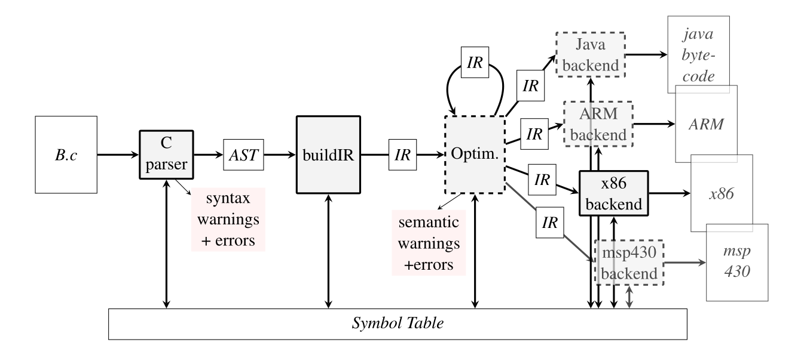

# C Compiler

This is a compiler for a subset of C, written by a group of 6 people for a class. The lexer and parser are generated with [Antlr4](https://www.antlr.org), while our compiler implements an **IR**, some **optimizations**, and assembler **code emission** for the x86 architecture.

## Architecture

- Antlr4 generates the lexer and parser from the grammar specified in [`ifcc.g4`](ifcc.g4).
- These Antlr classes generates the AST (Abstract Syntax Tree) from the source code.
- With a visitor pattern, the AST is then used by:
    - Type checking vistior
    - IR generation visitor
- The IR (Intermediate Representation) is composed of:
    - IR instructions: an abstraction over architecture dependent assembly instructions.
    - Basics blocks: a sequences of instructions without jumps. Each basic block has a scope, which contains a symbol table with all the variables declared, and a pointer to its parent scope.
    - Control flow graphs: a graph of basic blocks with the jumps between them, one graph per function.
- A constant propagation optimizer is applied to the IR.
- The IR is then used to generate the x86 assembly. It is achieved with a visitor pattern for decoupling, to easily add support for other architectures.

## Supported subset of C

- Comments with `/* */` and `//`
- Variables of type `int` and `char`
- Arrays (declaration, assignment, and access only)
- Arithmetic operators: `+` `-` `*` `/` `%`
- Logic operators: `|` `&` `^` `!`
- Comparison operators: `==` `!=` `<` `>` `<=` `>=`
- IO with `getchar` and `putchar`
- Functions (with a return value or `void`)
- Scopes with `{ }` (with variable shadowing)
- Control flow with `if` `else` `while`
- `break` and `continue`

Each feature was rigorously tested in the [tests](tests) directory, which serves as a detailed reference of the capabilities. Some example algorithms have been written in the [examples](tests/100_examples) directory to demonstrate the usability of the compiler.

The compiler also generates errors and warnings for various problems.

A more detailed [user manual](MANUAL.md) is available in French.

## Usage

### Dependency

Install Antlr4 using your system package manager, or by running the script `./install-antlr.sh`.

In the `makefile` directory, make a copy of the appropriate makefile for your platform, and rename it to `config.mk`. If you have used the installation script, you can skip this step.

### Compilation

Compile the project: `make -j` (this flag enables parallel compilation, which is much faster)

You can now compile a program from our subset of C to x86 assembler with `./ifcc program.c`

### Tests

Compile and run all tests: `make -j test`

To run a single test: `./ifcc-test.py program.c`

### Documentation

Generate the C++ documentation with [Doxygen](https://www.doxygen.nl/): `make doc`

The documentation is in HTML format. To view it, open the file `doc/index.html`.
